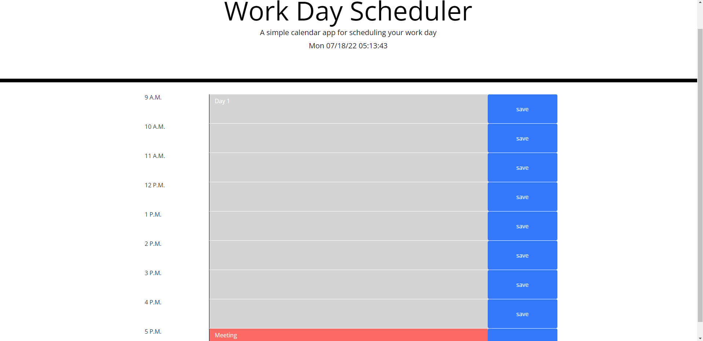

# Work_Daily_Planner

## Contributors:

* **Matthew Lyjak**

## Abstract:

This Project creates a Simple planning calendar for 1 work day and saves it in local storage

## Project Brief:

A user can enter text into the text boxes.  Pressing save will save it to local storage.  Any time block that is in the future is green, past is gray, and current hour is red.  There is also a running clock at the top of the page. 

## Technologies used:

* HTML
* CSS
* JavaScript
* GitHub
* momentJS API
* Various Hardware including multiple different screen sizes and mobile devices

## Description:

## Instructions for Future Developers:

Add draggable

## Known Bugs/Future Additions:

N/A

## License Information:

* Created by: Matthew Lyjak

